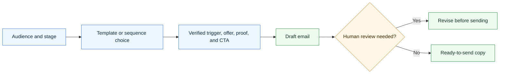

# Agentic Email Skill

A CompleteTech LLC Codex skill for creating agentic development outreach, sales, follow-up, delivery, retention, referral, and win-back emails.

## Workflow Diagram



## What It Does

- Selects the right email for the prospect or client stage.
- Drafts individual emails or full outreach/sales cadences.
- Keeps the pitch focused on practical agentic workflow development: discovery, implementation, evaluation, approval gates, monitoring, documentation, and handoff.
- Includes a near-exhaustive template catalog for end-to-end sales motion.

## Contents

- `SKILL.md` - operating instructions and template-selection guide.
- `references/email-catalog.md` - 52 reusable email templates.
- `references/use-case-decision-table.md` - quick guide for choosing the right email.
- `references/sequence-blueprints.md` - recommended multi-email cadences.
- `references/positioning.md` - CompleteTech LLC agentic development positioning and guardrails.
- `scripts/render_email.py` - deterministic template listing and rendering helper.

## Quick Start

```bash
python3 scripts/render_email.py --list
python3 scripts/render_email.py \
  --template cold-problem-pilot \
  --var prospect_name=Alex \
  --var company=Acme \
  --var trigger="the team is scaling support operations" \
  --var workflow="support triage"
```

Rendered templates are drafts. Replace placeholders with verified prospect, client, offer, proof, and timing details before use.

## Brand Notes

Use a direct, concrete, low-hype tone. Pitch agentic development as bounded workflow implementation with human approval gates, evaluation examples, logging, monitoring, and handoff documentation. Do not invent client proof, metrics, regulated-use assurances, or legal claims.
